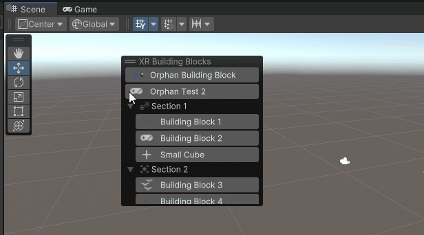
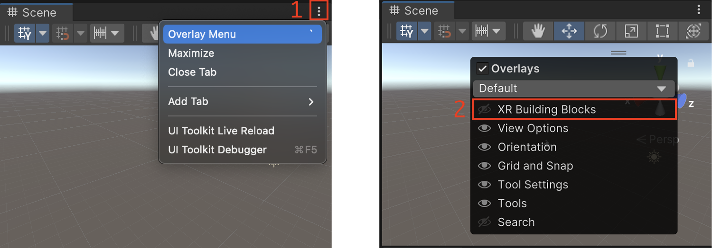
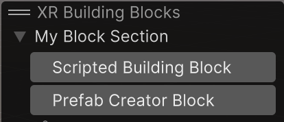

# XR Building Blocks

The building blocks system is an overlay window in the scene view that can help you quickly access commonly used items in your project. To open the building blocks overlay click on the hamburger menu on the scene view &gt; Overlay menu Or move the mouse over the scene view and press the "tilde" key. Afterwards just enable the Building Blocks overlay

A Building block is essentially a button that executes a script; be this to instantiate a prefab, create a scripted object or execute an action.

## Building Blocks and Building Block Sections

Building blocks can be arranged by sections, or can belong to no section at all.  Building blocks that do not belong to any section are considered *Unsectioned building blocks* -- and are not recommended due to their lack of organization.  A building block section contains a set of building blocks that can belong to the same package, workflow, or topic.

To create a building block section, your class must implement the `IBuildingBlockSection` interface.  In order to add a building block, your class must implement the `IBuildingBlock` interface.

Both sections and blocks have a name and an icon path so that they can be distinguished in the UI, either when they are docked, or when displayed as a UI overlay.

Building block sections are responsible for providing the building blocks they contain.  They do this by returning a collection of the building block instances through the `IEnumerable<IBuildingBlock> GetBuildingBlocks()` method.

### The `BuildingBlockItem` Attribute

In order for the building block system to recognize your sections, those building block section implementations must have a `[BuildingBlockItem(Priority = k_SectionPriority)]` attribute.  The `BuildingBlockManager` discovers those sections through that attribute.

Individual building block implementations may also have the attribute.  In this case, the building block will be treated as an unsectioned building block by the `BuildingBlockManager`, and will be displayed outside of any section.  For organizational purposes, this is not recommended.

The `Priority` member in this attribute is used to define the order in which sections appear in the building blocks overlay.  A smaller value (`int`) assigned to the `Priority` member will result in the building block section appearing higher within the overlay window compared to other building block sections.

Unsectioned building blocks are presented before sections, regardless of priority, and the priorities specified for those individual building block items also affect their display order within other unsectioned blocks.

## Prefab creator building block.

The `PrefabCreatorBuildingBlock` is a special type of building block that can be used in any building block section to simply instantiate a prefab. With this you don't need to create a building block for the sole purpose of instantiating prefabs.

Prefab creator building blocks are created inside the `BuildingBlockSection` implementations  and added in the `GetBuildingBlocks()` method as mentioned above.

# Example of a Building Block implementation

The example below creates two building blocks (_Scripted Building Block_ and _Prefab Creator Block_) under a section called _My Block Section_.

The _scripted building block_ (when pressed) will create an empty game object called "Empty Object" and the _Prefab Creator Block_ building block shows how to use the `PrefabCreatorBuildingBlock` block mentioned above; you will need to set the `m_PrefabAssetPath` variable accordingly to point to a prefab for it to instantiate correctly.

[!code-cs[building_blocks_sample](../Tests/Editor/CodeSamples/ScriptedBuildingBlockSample.cs#building_blocks_sample)]
