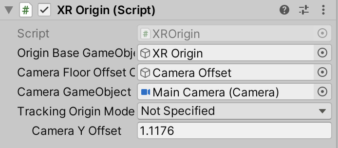

# XR Origin component

The purpose of the XR Origin is to transform objects and trackable features to their final position, orientation, and scale in the Unity scene.

 *XR Origin Component properties*

| **Property**                             | **Description** |
|------------------------------------------|-----------------|
| **Origin Base GameObject**               | The GameObject whose Transform serves as the origin for trackables or device-relative elements in an XR scene. |
| **Camera Floor Offset GameObject**       | GameObject that offsets the [Camera](xref:UnityEngine.Camera) position from the XR Origin. The XR Origin component controls the Y coordinate of the [Transform](xref:UnityEngine.Transform) of this GameObject according to the chosen **Tracking Origin Mode** option: <ul><li>**Device**: initialized to the value specified by **Camera Y Offset**. Reset when the user resets the view.</li><li>**Floor**: initialized to zero.</li></ul> |
| **Camera**                               | The Camera for the XR Origin. The GameObject containing this Camera must be underneath the **Origin Base GameObject** in the Scene hierarchy. It should be a child of the **Camera Floor Offset GameObject**. This [Camera](xref:UnityEngine.Camera) is used to render the XR scene. |
| **Tracking Origin Mode**                 | Specifies spatial relationship between the XR Origin and the XR device. (Refer to the following table to understand the tracking origin mode options. |
| **Camera Y Offset**                      | The distance to offset the [Camera](xref:UnityEngine.Camera) from the XR Origin when the **Device** tracking origin mode is active. Only displayed when either **Not Specified** or **Device** is enabled. |

### Tracking origin mode

The following table describes the three options for the XR Origin tracking origin mode property:

| **Tracking origin mode** | **Description** |
| :----------------------- | :-------------- |
|  **Not Specified**                      | Use the default tracking mode of the device (either **Device** or **Floor**). |
|  **Device**                             | In this mode, you manually set the height of the user (for VR) or their hand-held device (for AR) with the **Camera Y Offset** value. In this mode, the height is not included in the [Poses](xref:UnityEngine.Pose) returned by [XR Input Subsystem](xref:xrsdk-input). At runtime, you must make any needed adjustments manually, which you can do by changing the [XROrigin.CameraYOffset](xref:Unity.XR.CoreUtils.XROrigin.CameraYOffset) property. |
|  **Floor**                              | Differs from the **Device** mode by deriving the height based on the "floor" or other surface determined by the XR device. In this mode, the height of the user (for VR) or the device (for AR) is included in the [Poses](xref:UnityEngine.Pose) returned by [XR Input Subsystem](xref:xrsdk-input). |

## XR Origin hierarchy

The [XROrigin](xref:Unity.XR.CoreUtils.XROrigin) component is designed to work in a specific hierarchy of GameObjects and related components. A typical, recommended setup for an XR Scene includes the following GameObjects and Components:

| **GameObjects**         | **Components**                                                                                           |
|-------------------------|---------------------------------------------------------------------------------------------------------|
| **XR Origin**           | [XROrigin](xref:Unity.XR.CoreUtils.XROrigin)                                                            |
| **Camera Offset**       | None                                                                                                    |
| **Main Camera**         | [Camera](xref:UnityEngine.Camera), [TrackedPoseDriver](xref:UnityEngine.InputSystem.XR.TrackedPoseDriver), [ARCameraManager](xref:UnityEngine.XR.ARFoundation.ARCameraManager) (AR), [ARCameraBackground](xref:UnityEngine.XR.ARFoundation.ARCameraBackground) (AR) |
| **LeftHand Controller** | [XRController](xref:UnityEngine.XR.Interaction.Toolkit.ActionBasedController), [XRRayInteractor](xref:UnityEngine.XR.Interaction.Toolkit.XRRayInteractor), [LineRenderer](xref:UnityEngine.LineRenderer), [XRInteractorLineVisual](xref:UnityEngine.XR.Interaction.Toolkit.XRInteractorLineVisual) |
| **RightHand Controller**| [XRController](xref:UnityEngine.XR.Interaction.Toolkit.ActionBasedController), [XRRayInteractor](xref:UnityEngine.XR.Interaction.Toolkit.XRRayInteractor), [LineRenderer](xref:UnityEngine.LineRenderer), [XRInteractorLineVisual](xref:UnityEngine.XR.Interaction.Toolkit.XRInteractorLineVisual) |

> [!NOTE]
> You can have more than one XR Origin in a scene, but only one should be enabled at any given time. For example, if you need different XR Origin configurations in the same scene, you can add them to the scene and choose the one to enable as needed.

## XR Origin configurations

Depending on which XR packages you have added to your project, Unity provides a few menu options that add the recommended XR Origin configurations to a scene. You can add the desired configuration to the scene using the **GameObject** > **XR** menu. The XR Origin configurations include:

* **XR Origin (VR)**: Adds the XR Origin, Camera Offset GameObject, Camera, and left and right controllers to the scene. Use for Virtual Reality scenes. Included with the [XR Interaction Toolkit](https://docs.unity3d.com/Packages/com.unity.xr.interaction.toolkit@latest) package.
* **XR Origin (AR)**: Similar to the VR version, but sets the Camera properties appropriately for Mixed and Augmented Reality and adds related AR Camera components. Included with the [AR Foundation](https://docs.unity3d.com/Packages/com.unity.xr.arfoundation@latest) package (only shown when the XR Interaction Toolkit package is also installed).
* **XR Origin (Mobile AR)**: The same as the AR version, but does not include GameObjects for the controllers. Included with the [AR Foundation](https://docs.unity3d.com/Packages/com.unity.xr.arfoundation@latest) package.
* **Device based** > **XR Origin (VR)**: Adds the XR Origin, Camera Offset GameObject, Camera, and left and right controllers to the scene. The controllers in this configuration use device-based input components that map app behaviors directly to the controller buttons and joysticks. Use for Virtual Reality scenes when using the legacy Input Manager. Included with the [XR Interaction Toolkit](https://docs.unity3d.com/Packages/com.unity.xr.interaction.toolkit@latest) package (not all Interaction Toolkit features are supported when using device-based input).

> [!TIP]
> You can simply delete the controller GameObjects from the VR or AR configurations if your app doesn't need controllers.

> [!IMPORTANT]
> Additional setup is required to configure the left- and right-hand controller objects to process tracking data and user input. See [General setup](https://docs.unity3d.com/Packages/com.unity.xr.interaction.toolkit@latest?subfolder=/manual/general-setup.html) in the [XR Interaction Toolkit](https://docs.unity3d.com/Packages/com.unity.xr.interaction.toolkit@latest) documentation for more information.
